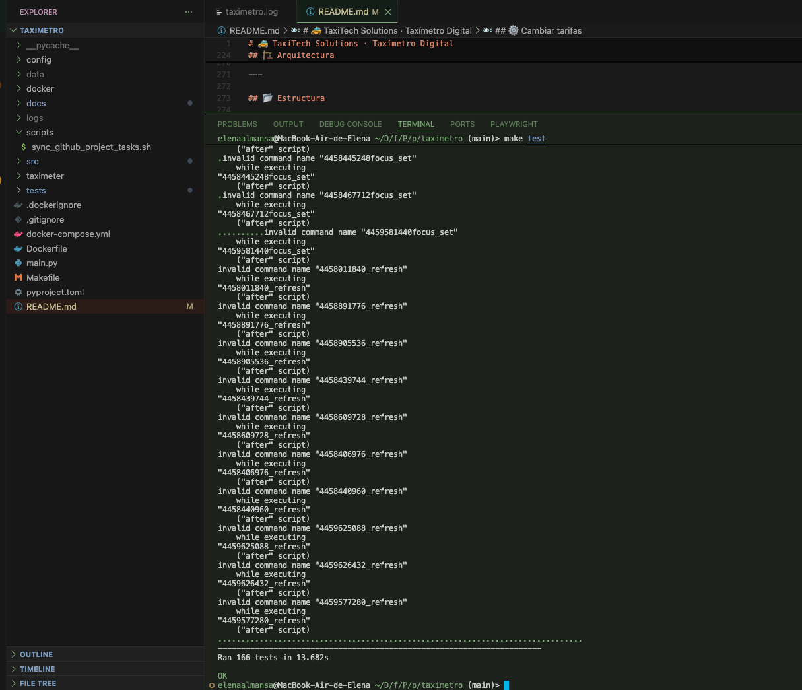
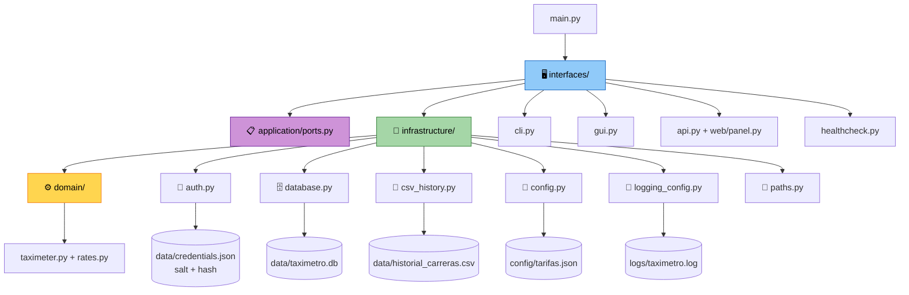

# 🚕 TaxiTech Solutions · Taxímetro Digital

<p align="center">
  <em>Prototipo en Python para calcular el importe de carreras de taxi en tiempo real</em>
</p>

<p align="center">
  
  
  
  
  
</p>

---

## 💰 Tarifas por defecto

- CLI para iniciar, cambiar estado, finalizar y encadenar carreras.
- Calculo continuo por tramos segun el estado del taxi.
- Historico persistente en SQLite `data/taximetro.db` y CSV heredado `data/historial_carreras.csv`.
- API REST de solo lectura para consultar el historial desde otros sistemas.
- Panel web del historial para revisarlo desde el navegador.
- Logs tecnicos en `logs/taximetro.log`.
- Tarifas configurables en `config/tarifas.json`.
- Tests automatizados con `unittest`.
- Acceso protegido con contraseña hasheada mediante PBKDF2, almacenada en `data/credentials.json` con permisos `600`.
- Interfaz grafica Tkinter con botones grandes.

---

## ✨ Funcionalidades

- 🖥️ **CLI interactiva** — iniciar, cambiar estado, finalizar y encadenar carreras.
- 📊 **Cálculo continuo** por tramos según el estado del taxi.
- 🔐 **Acceso protegido con contraseña** — PBKDF2-HMAC-SHA256 con 600.000 iteraciones y salt aleatorio por credencial; nunca se guarda en claro.
- 🖼️ **Interfaz gráfica moderna** (customtkinter) con tema oscuro elegante, botones grandes de colores y píldora de estado que cambia según la carrera.
- 📁 **Histórico persistente** en `data/historial_carreras.csv`.
- ⚙️ **Tarifas configurables** en `config/tarifas.json`.
- 📝 **Logs técnicos** en `logs/taximetro.log`.
- ✅ **165 tests automatizados** con `unittest`.

---

## 🚀 Uso rápido

El taximetro se puede usar sin instalar nada: `python3 main.py` funciona
directamente desde el repositorio. Para instalarlo como paquete:

```bash
pip install -e .            # base: sin dependencias externas
pip install -e ".[gui]"     # anade customtkinter para la GUI
```

Instalado, aparece el comando `taximetro`, equivalente a `python3 main.py`.

### CLI

```bash
python3 main.py
```

En la primera ejecucion el programa pedira crear una contraseña. La contraseña
nunca se guarda en texto plano: se almacena su hash PBKDF2-HMAC-SHA256 con un
salt aleatorio, y el archivo de credenciales se crea con permisos `600`. Si el
archivo llega a estar dañado, la aplicacion lo detecta y ofrece restablecer la
contraseña en lugar de quedar bloqueada en la pantalla de acceso.

Comandos disponibles:

- `inicio` o `i`: iniciar carrera.
- `parado` o `p`: cambiar a taxi parado.
- `marcha` o `m`: cambiar a taxi en movimiento.
- `ver` o `v`: ver estado, tiempo e importe actual.
- `fin` o `f`: finalizar carrera y guardar el historico.
- `historial` o `h`: mostrar carreras guardadas.
- `salir` o `s`: cerrar el programa.

## Migrar historial a SQLite

La migracion documentada en `docs/prod-01-migracion-historial.md` se ejecuta desde la raiz del proyecto:

```bash
python3 main.py --migrate-history
```

El informe muestra las filas importadas, las ya existentes y las rechazadas con su linea y motivo. La migracion es idempotente y conserva `data/historial_carreras.csv` sin modificarlo. La CLI y la GUI consultan las carreras desde `data/taximetro.db`; no borres el CSV hasta verificar el informe y consultar la informacion importada.

## API REST del historial

Consulta el historial mediante HTTP. La API es de **solo lectura** y escucha en
`127.0.0.1:8000` por defecto:

```bash
python3 main.py --api
```

```bash
curl http://127.0.0.1:8000/api/v1/trips
```

El unico endpoint es `GET /api/v1/trips`, que devuelve una coleccion JSON con
`date`, `duration_seconds` y `amount` de cada carrera, o una lista vacia si no
hay carreras. Los recursos inexistentes devuelven `404` y los metodos distintos
de `GET` devuelven `405`. Se puede cambiar la direccion y el puerto con
`--api-host` y `--api-port`.

La documentacion completa, con ejemplos de respuestas y errores, esta en
`docs/prod-02-api-rest.md`. La API no requiere contrasena: antes de exponerla
fuera del vehiculo hay que revisar los riesgos pendientes de ese documento.

## Panel web del historial

El mismo servicio publica el historial como pagina web en la raiz:

```text
Panel web del historial: http://127.0.0.1:8000/
```

Basta con abrir `http://127.0.0.1:8000/` en el navegador. Cada carrera aparece
con fecha, duracion e importe en formato legible, y el panel avisa
claramente cuando no hay carreras. El HTML se genera en el servidor, sin
JavaScript ni recursos externos.

El historial se lee de la base en cada peticion, asi que al terminar una carrera
y recargar la pagina aparece el registro nuevo sin reiniciar el servicio. Es de
solo lectura: crear, editar, buscar, filtrar y exportar quedan fuera de alcance.

La documentacion completa esta en `docs/prod-03-panel-web.md`. El panel tampoco
requiere contrasena, con el mismo aviso que la API.

## Uso GUI

```bash
pip install -e ".[gui]"   # primera vez, instala customtkinter
python3 main.py --gui
```

La GUI es la única parte que necesita una dependencia externa
(`customtkinter`), y va en el extra `gui` para que el despliegue en
contenedor, que no la usa, no la instale. Sin ese extra, `python3 main.py`
arranca igual, pero `--gui` falla al importar `customtkinter`.

La primera ejecución solicita crear y confirmar una contraseña; en las siguientes, la GUI requiere autenticarse antes de mostrar el taxímetro. Si la contraseña es incorrecta muestra un error y permite reintentar (se puede confirmar con la tecla <kbd>Enter</kbd>).

Interfaz con **tema oscuro elegante**: tarjetas redondeadas, importe grande de lectura inmediata y una **píldora de estado** que cambia de gris (sin carrera) a ámbar (parado) y verde (en movimiento). Los botones `Iniciar` (verde), `Parado` (ámbar), `Marcha` (cian), `Finalizar` (rojo) e `Historial` (gris) se actualizan cada 500 ms.

---

## ⌨️ Comandos CLI

| Comando | Alias | Descripción |
| :--- | :---: | :--- |
| `inicio` | `i` | Iniciar carrera |
| `parado` | `p` | Cambiar a taxi parado |
| `marcha` | `m` | Cambiar a taxi en movimiento |
| `ver` | `v` | Ver estado, tiempo e importe actual |
| `fin` | `f` | Finalizar carrera y guardar en el histórico |
| `historial` | `h` | Mostrar carreras guardadas |
| `salir` | `s` | Cerrar el programa |

---

## ⚙️ Cambiar tarifas

Las tarifas se cargan al iniciar el programa (CLI y GUI). Los cambios se aplican en la siguiente ejecución; no se recargan durante una carrera.

```json
{
  "stopped_rate_per_second": 0.02,
  "moving_rate_per_second": 0.05
}
```

Si el fichero falta, tiene un JSON mal formado, le falta una clave o contiene una tarifa no numérica o negativa, el programa **no inicia** y muestra un error de configuración identificable.

---

## Despliegue

El despliegue es un contenedor Docker. El destino, los prerrequisitos y el
procedimiento completo estan en
[docs/prod-04-despliegue.md](docs/prod-04-despliegue.md).

Prerrequisito: un runtime de contenedores, Docker Desktop o Colima.

```bash
colima start --cpu 2 --memory 4 --disk 20
```

Un unico comando construye la imagen, levanta el servicio y espera a que la
comprobacion de operatividad confirme que la aplicacion esta lista:

```bash
make deploy
```

Para usar el taximetro:

```bash
make cli
```

El historial, la contrasena, las tarifas y los logs viven en un volumen de
Docker montado en `/var/lib/taximetro` y sobreviven a `make down` +
`make deploy`. Solo `make down-volumes` los borra.

La comprobacion automatica no abre ventana y se puede ejecutar por separado:

```bash
make check
```

## Tests

```bash
make test

# o sin el Makefile:
python3 -m unittest discover -s tests -t .
```

<p align="center">
  
</p>

> **165 tests OK** — cubren dominio, configuración, autenticación, histórico, logging y las dos interfaces (CLI y GUI).

---

## 🏗️ Arquitectura

Cuatro capas dentro de `src/taximeter/`. Las dependencias apuntan **hacia
dentro**: las interfaces conocen la infraestructura, la infraestructura
conoce el dominio, y el dominio no depende de nada.



**Claves de diseño:**

- 🧠 `domain/` es **código de dominio puro**: no hace E/S y recibe las tarifas y un **reloj inyectado**, lo que permite simular carreras de 30 s en microsegundos durante los tests.
- 🔒 `application/ports.py` define el contrato `HistoryRepository`; el dominio no sabe si el historial vive en SQLite o en CSV.
- 🔌 **Sin acoplamiento a ficheros**: cada componente recibe su ruta por parámetro con un valor por defecto, resuelto en el momento de construirlo y no al importar, para que `TAXIMETER_HOME` se tenga en cuenta.
- 🔁 **CLI, GUI, API y panel comparten el mismo dominio**.
- 🛡️ `tests/test_architecture.py` falla si alguna capa importa hacia arriba, de modo que la estructura no se deshace sin avisar.

---

## 📂 Estructura

```bash
.
├── config/tarifas.json
├── docker/entrypoint.sh
├── docs/
│   ├── github-project-tasks.md
│   └── prod-04-despliegue.md
├── main.py
├── pyproject.toml
├── src/taximeter/
│   ├── domain/            # sin dependencias: reglas de negocio
│   │   ├── rates.py
│   │   └── taximeter.py
│   ├── application/       # casos de uso y puertos
│   │   └── ports.py
│   ├── infrastructure/    # persistencia, ficheros, config y logging
│   │   ├── auth.py
│   │   ├── config.py
│   │   ├── csv_history.py
│   │   ├── database.py
│   │   ├── logging_config.py
│   │   ├── migration.py
│   │   └── paths.py
│   └── interfaces/        # CLI, GUI, API, panel y healthcheck
│       ├── api.py
│       ├── cli.py
│       ├── gui.py
│       ├── healthcheck.py
│       └── web/panel.py
├── tests/
│   ├── test_api.py
│   ├── test_architecture.py
│   ├── test_auth.py
│   ├── test_cli.py
│   ├── test_config.py
│   ├── test_database.py
│   ├── test_deploy_security.py
│   ├── test_gui.py
│   ├── test_healthcheck.py
│   ├── test_history.py
│   ├── test_history_interfaces.py
│   ├── test_logging.py
│   ├── test_migration.py
│   ├── test_panel.py
│   ├── test_paths.py
│   └── test_taximeter.py
├── Dockerfile
├── Makefile
└── docker-compose.yml
```

## Historias cubiertas

| ID | Estado |
| --- | --- |
| US-01 | Implementada |
| US-02 | Implementada |
| US-03 | Implementada |
| US-04 | Implementada |
| US-05 | Implementada |
| US-06 | Implementada |
| US-07 | Implementada |
| US-08 | Implementada |
| US-09 | Implementada |
| PROD-04 | Implementada |

Fase 4 documentada: el despliegue reproducible con un comando esta en PROD-04. La
API REST (PROD-02) y el panel web (PROD-03) siguen developing en sus respectivas
ramas.

---

## 👩💻 Autora

**Elena Almansa** · TaxiTech Solutions

[](https://github.com/elenaalmansacampos)
[](https://www.linkedin.com/in/elena-almansa-5315a017/)
