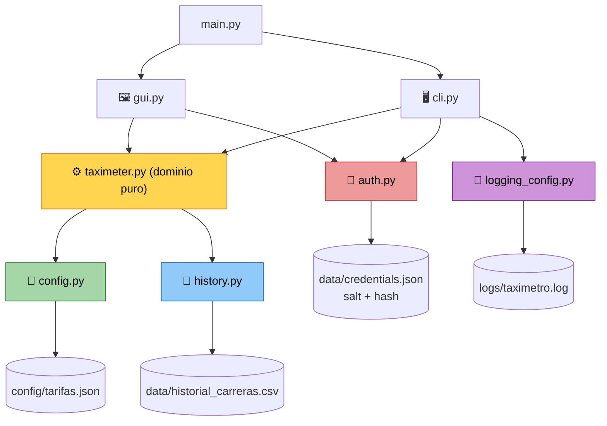

# 🚕 TaxiTech Solutions · Taxímetro Digital

<p align="center">
  <em>Prototipo en Python para calcular el importe de carreras de taxi en tiempo real</em>
</p>

<p align="center">
  
  
  
  
  
</p>

---

## 💰 Tarifas por defecto

| Estado | Tarifa |
| :---: | :---: |
| 🅿️ Parado o velocidad < 20 km/h | `0,02 €/s` |
| 🚗 En movimiento | `0,05 €/s` |

---

## ✨ Funcionalidades

- 🖥️ **CLI interactiva** — iniciar, cambiar estado, finalizar y encadenar carreras.
- 📊 **Cálculo continuo** por tramos según el estado del taxi.
- 🔐 **Acceso protegido con contraseña** — PBKDF2-HMAC-SHA256 con 600.000 iteraciones y salt aleatorio por credencial; nunca se guarda en claro.
- 🖼️ **Interfaz gráfica Tkinter** con botones grandes y actualización automática cada 500 ms.
- 📁 **Histórico persistente** en `data/historial_carreras.csv`.
- ⚙️ **Tarifas configurables** en `config/tarifas.json`.
- 📝 **Logs técnicos** en `logs/taximetro.log`.
- ✅ **61 tests automatizados** con `unittest`.

---

## 🚀 Uso rápido

### CLI

```bash
python3 main.py
```

**Primera ejecución:** el programa pide crear una contraseña y confirmarla, sin mostrar los caracteres (mínimo 4 caracteres).
**Ejecuciones siguientes:** pide la contraseña para entrar; si es incorrecta, la CLI termina con **código de salida 1**.

### GUI

```bash
python3 main.py --gui
```

La primera ejecución solicita crear y confirmar una contraseña; en las siguientes, la GUI requiere autenticarse antes de mostrar el taxímetro. Si la contraseña es incorrecta muestra un error y permite reintentar.

La pantalla ofrece los botones `Iniciar`, `Parado`, `Marcha`, `Finalizar` e `Historial` (tipografía 18, altura de tres filas). Muestra estado, tiempo e importe, y se actualiza cada 500 ms.

---

## ⌨️ Comandos CLI

| Comando | Alias | Descripción |
| :--- | :---: | :--- |
| `inicio` | `i` | Iniciar carrera |
| `parado` | `p` | Cambiar a taxi parado |
| `marcha` | `m` | Cambiar a taxi en movimiento |
| `ver` | `v` | Ver estado, tiempo e importe actual |
| `fin` | `f` | Finalizar carrera y guardar en el histórico |
| `historial` | `h` | Mostrar carreras guardadas |
| `salir` | `s` | Cerrar el programa |

---

## ⚙️ Cambiar tarifas

Las tarifas se cargan al iniciar el programa (CLI y GUI). Los cambios se aplican en la siguiente ejecución; no se recargan durante una carrera.

```json
{
  "stopped_rate_per_second": 0.02,
  "moving_rate_per_second": 0.05
}
```

Si el fichero falta, tiene un JSON mal formado, le falta una clave o contiene una tarifa no numérica o negativa, el programa **no inicia** y muestra un error de configuración identificable.

---

## 🧪 Tests

```bash
python3 -m unittest
```

> **61 tests OK** — cubren dominio, configuración, autenticación, histórico, logging y las dos interfaces (CLI y GUI).

---

## 🏗️ Arquitectura

Separación en tres capas: **presentación** (CLI/GUI), **dominio** puro sin E/S y **infraestructura** (ficheros y logs).



**Claves de diseño:**

- 🧠 `Taximeter` es **código de dominio puro**: no hace E/S y recibe las tarifas y un **reloj inyectado**, lo que permite simular carreras de 30 s en microsegundos durante los tests.
- 🔌 **Sin acoplamiento a ficheros**: cada componente recibe su ruta por parámetro con un valor por defecto.
- 🔁 **CLI y GUI comparten el mismo dominio**: ambas usan `Taximeter`, `TripHistory` y `PasswordAuth`.
- 🛡️ **Validación exhaustiva** de la configuración: tipos, valores no negativos, números finitos y JSON mal formado.

---

## 📂 Estructura

```bash
.
├── config/tarifas.json        # tarifas configurables
├── data/                      # generado en runtime (git ignored)
│   ├── credentials.json       # salt + hash de la contraseña
│   └── historial_carreras.csv
├── docs/github-project-tasks.md
├── logs/taximetro.log         # generado en runtime (git ignored)
├── main.py
├── scripts/sync_github_project_tasks.sh
├── taximeter/
│   ├── auth.py                # autenticación PBKDF2
│   ├── cli.py                 # interfaz de línea de comandos
│   ├── config.py              # carga y validación de tarifas
│   ├── gui.py                 # interfaz gráfica Tkinter
│   ├── history.py             # histórico CSV
│   ├── logging_config.py      # configuración de logs
│   └── taximeter.py           # núcleo de cálculo (dominio puro)
└── tests/
    ├── test_auth.py
    ├── test_cli.py
    ├── test_config.py
    ├── test_gui.py
    ├── test_history.py
    ├── test_history_interfaces.py
    ├── test_logging.py
    └── test_taximeter.py
```

---

## 🗃️ Historias de usuario

| ID | Historia | Estado |
| :---: | :--- | :---: |
| US-01 | Iniciar una carrera desde CLI | ✅ |
| US-02 | Cambiar estado entre parado y movimiento | ✅ |
| US-03 | Finalizar carrera y mostrar total | ✅ |
| US-04 | Encadenar varias carreras sin cerrar el programa | ✅ |
| US-05 | Guardar y consultar histórico de carreras | ✅ |
| US-06 | Registrar logs de operación y errores | ✅ |
| US-07 | Cargar tarifas desde fichero de configuración | ✅ |
| US-08 | Proteger acceso con contraseña segura | ✅ |
| US-09 | Crear interfaz gráfica con botones grandes | ✅ |

---

## 🔮 Requisitos y evolución

- **Requisitos:** Python 3.10 o superior · **0 librerías externas**.
- La **fase 4** queda documentada como evolución futura porque requiere API, base de datos y despliegue.
